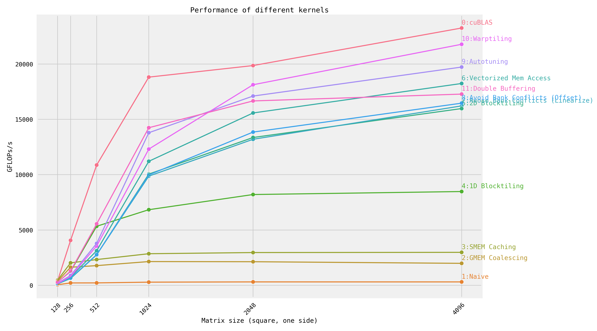

# Fast CUDA SGEMM from Scratch

Step-by-step optimization of matrix multiplication, implemented in CUDA.
For an explanation of each kernel, see [siboehm.com/CUDA-MMM](https://siboehm.com/articles/22/CUDA-MMM).

📺 **中文视频讲解 / Chinese Video Walkthrough:** [Bilibili BV1TXTM6sEQE](https://www.bilibili.com/video/BV1TXTM6sEQE/)

## Overview

Running the kernels on a NVIDIA RTX 5050 Laptop (Blackwell, CC 12.0):

> ⚠️ **CUDA 12.8+ required** for Blackwell (CC 12.0). CUDA 12.6 and earlier do not support `compute_120`.

### Benchmark: 4096×4096 SGEMM (GFLOPS)

<!-- benchmark_results -->
| Kernel                              |  GFLOPs/s | Relative to cuBLAS | Notes |
|:------------------------------------|----------:|:--------------------|:------|
| 1: Naive                            |   `108.2` | 1.4%               |       |
| 2: GMEM Coalescing                  |   `716.3` | 9.3%               |       |
| 3: SMEM Caching                     |   `999.2` | 12.9%              |       |
| 4: 1D Blocktiling                   |  `3057.6` | 39.5%              |       |
| 5: 2D Blocktiling                   |  `5018.3` | 64.9%              |       |
| 8: Avoid Bank Conflicts (Offset)    |  `4660.9` | 60.3%              |       |
| 7: Avoid Bank Conflicts (Linearize) |  `5685.4` | 73.5%              |       |
| 6: Vectorized Mem Access            |  `6299.1` | 81.4%              |       |
| 9: Autotuning                       |  `6673.7` | 86.3%              |       |
| 10: Warptiling 🏆                    |  `7728.0` | **99.9%**          | 追平 cuBLAS |
| 0: cuBLAS                           |  `7734.4` | 100.0%             |       |
| 12: Double Buffering v2             |   `776.4` | 10.0%              | 性能回退 |
| 11: Double Buffering                |        ❌ | —                  | 验证失败 |
<!-- benchmark_results -->

Kernel 11: `Divergence! Should 33.02, Is 61.26 (Diff 28.24) at 132` at 128×128 — verification failed.

### Test Environment

| Item | Detail |
|------|--------|
| GPU | NVIDIA GeForce RTX 5050 Laptop (Blackwell, CC 12.0, 8 GB VRAM) |
| OS | WSL Ubuntu (Windows Subsystem for Linux) |
| CUDA Toolkit | 12.8 (`/usr/local/cuda-12.8/bin/nvcc`) |
| C++ Compiler | GCC 13 (`/usr/bin/c++`, C++20) |
| CMake | miniconda3 env `SGEMM_CUDA` |
| Build Type | Release (`-O3 -DNDEBUG`) |
| NVCC Arch | `--generate-code=arch=compute_120,code=[compute_120,sm_120]` |
| Driver | 12.8 (Windows host) |

**Benchmark methodology:**
- Matrix sizes: 128, 256, 512, 1024, 2048, 4096 (square)
- GEMM: `C = 0.5·A·B + 3.0·C`
- Random initialization (range ±5), verified against cuBLAS `CUBLAS_COMPUTE_32F` (tolerance 0.01)
- GPU timing via `cudaEvent`, 50 repetitions averaged per size
- Warmup run before timing to avoid cold-start artifacts

### Historical: NVIDIA A6000 (Ampere, CC 8.0)



| Kernel                              |  GFLOPs/s | Performance relative to cuBLAS |
|:------------------------------------|----------:|:-------------------------------|
| 1: Naive                            |   `309.0` | 1.3%                           |
| 2: GMEM Coalescing                  |  `1986.5` | 8.5%                           |
| 3: SMEM Caching                     |  `2980.3` | 12.8%                          |
| 4: 1D Blocktiling                   |  `8474.7` | 36.5%                          |
| 5: 2D Blocktiling                   | `15971.7` | 68.7%                          |
| 7: Avoid Bank Conflicts (Linearize) | `16213.4` | 69.7%                          |
| 8: Avoid Bank Conflicts (Offset)    | `16459.2` | 70.8%                          |
| 11: Double Buffering                | `17278.3` | 74.3%                          |
| 6: Vectorized Mem Access            | `18237.3` | 78.4%                          |
| 9: Autotuning                       | `19721.0` | 84.8%                          |
| 10: Warptiling                      | `21779.3` | 93.7%                          |
| 0: cuBLAS                           | `23249.6` | 100.0%                         |

## Setup

### Prerequisites

| Dependency | Version | Notes |
|------------|---------|-------|
| CUDA Toolkit | **≥ 12.8** | Blackwell (CC 12.0) requires 12.8+ |
| CMake | ≥ 3.19 | |
| Python | ≥ 3.10 | For plotting (`seaborn`) |
| C++ Compiler | GCC 13+ | C++20 required |

See [environment.yml](environment.yml) for the conda environment.

### Configure Compute Capability

Set your GPU's compute capability in [CMakeLists.txt](CMakeLists.txt):
```cmake
set(CUDA_COMPUTE_CAPABILITY 120)   # Blackwell (RTX 50xx)
# set(CUDA_COMPUTE_CAPABILITY 89)  # Ada Lovelace (RTX 40xx)
# set(CUDA_COMPUTE_CAPABILITY 80)  # Ampere (A6000/A100)
```
Look up yours at [NVIDIA CUDA GPUs](https://developer.nvidia.com/cuda-gpus).

### Build (WSL Ubuntu / Linux)

```bash
# 1. Activate conda environment (if using conda)
conda activate SGEMM_CUDA

# 2. Configure
cmake -B build -DCMAKE_BUILD_TYPE=Release -DCMAKE_CUDA_COMPILER=/usr/local/cuda/bin/nvcc

# 3. Build
cmake --build build --config Release
```

### Run

```bash
# Single kernel
./build/sgemm <kernel_number>        # e.g., ./build/sgemm 10

# All kernels (0-12)
for k in 0 1 2 3 4 5 6 7 8 9 10 11 12; do
  echo "=== Kernel $k ==="
  ./build/sgemm $k
  echo
done

# On specific device
DEVICE=<device_id> ./build/sgemm <kernel_number>
```

### Profile

```bash
# NVIDIA Nsight Compute
ncu --kernel-name runSgemm ./build/sgemm <kernel_number>
make profile KERNEL=<kernel_number>
```

Credit goes to [wangzyon/NVIDIA_SGEMM_PRACTICE](https://github.com/wangzyon/NVIDIA_SGEMM_PRACTICE) for the benchmarking setup.
